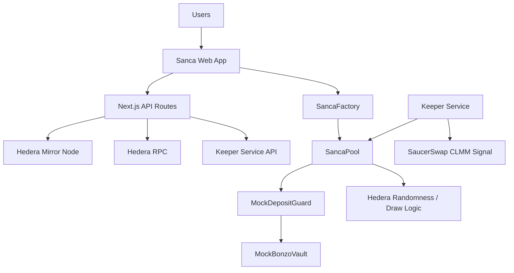

# Sanca

> AI-Managed DeFi ROSCA on Hedera.

[](https://opensource.org/licenses/MIT)
[](https://soliditylang.org/)
[](https://nextjs.org/)

## Hackathon Alignment

`Main Track`: `DeFi & Tokenization`  
`Bounty`: `Bonzo`

## Category

**AI-Managed DeFi ROSCA**

Sanca is not just a DeFi vault. It is an **AI-managed community finance protocol** built on Hedera.

## Submission Links

- `Web`: [https://sanca.space](https://sanca.space)
- `Demo Video`: [Sanca Demo](https://drive.google.com/file/d/1SrHzDfdHLnHOUVXtnoxcQ3gJrHCzwSs0/view?usp=drive_link)
- `Pitch Deck`: [Canva Pitch Deck](https://www.canva.com/design/DAHEanRwe6Y/GLwUWhTcYiTAkR50aakjRw/edit?utm_content=DAHEanRwe6Y&utm_campaign=designshare&utm_medium=link2&utm_source=sharebutton)

## One-Line Pitch

Sanca transforms traditional savings circles into AI-managed DeFi infrastructure where community capital earns yield, payouts are automated, and vault risk is actively managed through an intelligent keeper.

## Project Description

Sanca is an AI-managed DeFi ROSCA protocol on Hedera. Users join transparent community savings pools, contribute in cycles, and receive automated payouts while pooled collateral is routed into a Bonzo-style vault flow instead of sitting idle. A volatility-aware AI keeper agent monitors `HBAR/USDC`, generates rebalance decisions, and executes vault maintenance through `SancaPool`, turning community savings into productive on-chain capital with visible yield, automated coordination, and risk-aware vault management.

## DeFi & Tokenization Alignment

Sanca is a full-stack community finance protocol that combines:
- a real-world financial primitive: ROSCA
- productive on-chain capital instead of idle balances
- tokenized vault-style exposure through Bonzo-like share accounting
- automated payout infrastructure
- an AI-managed risk layer for vault operations

In one sentence:

> Sanca is not just a DeFi vault. It is an AI-managed community finance protocol.

This framing highlights both:
- the human problem being solved
- the DeFi infrastructure that makes the solution more capital-efficient

## Bonzo Bounty Alignment

For the `Bonzo` bounty, Sanca focuses on one specific interpretation of the prompt:

### The Volatility-Aware Rebalancer

Sanca implements the first Bonzo example directly:
- monitor `HBAR/USDC` market conditions
- compute a structured volatility regime
- decide whether to `rebalance`, `collectFees`, or `noop`
- execute through `SancaPool`, preserving pool-owned vault accounting

This means the keeper is not a generic chatbot. It is a narrow, purpose-built intelligence layer for DeFi infrastructure.

This scope keeps the implementation:
- clear problem selection
- technical focus
- production-minded architecture
- a credible path from testnet mock to Bonzo-like mainnet parity

## The Problem

Traditional ROSCAs are one of the most battle-tested community finance models in the world, but they suffer from five structural weaknesses:

1. They require trust in a coordinator.
2. They are operationally manual.
3. Contributions and payouts are not transparently auditable.
4. Idle collateral does not earn yield.
5. Member default creates social and financial risk.

At the same time, modern DeFi vaults solve yield generation but do not solve community-native capital coordination. And even vaults themselves are still often managed by static keepers that react too slowly to changing volatility conditions.

Sanca connects these two worlds:
- community savings coordination
- programmable yield infrastructure
- intelligent vault maintenance

## The Solution

Sanca is a trustless ROSCA system on Hedera where:
- users create or join community savings pools
- contributions and payouts are enforced by smart contracts
- pooled collateral is deposited into a Bonzo-style vault flow
- vault shares remain owned by `SancaPool`
- a specialized keeper agent manages risk-aware vault maintenance

This creates a full-stack DeFi product rather than a contract-only demo:
- user-facing community savings UX
- automated payout infrastructure
- yield-bearing collateral
- observability APIs
- AI-managed vault operations

## Product Narrative

Sanca can be explained in two layers:

> “A modern savings circle where the money doesn’t sit still.”

and

> “An AI-managed community finance protocol.”

Instead of leaving pooled collateral idle, Sanca routes it into a Bonzo-style yield strategy and layers an intelligent keeper on top to improve how that capital is managed. The system is designed to be legible to users and extensible toward real mainnet deployment.

The project maps cleanly to common evaluation dimensions:
- `Innovation`: community finance + DeFi vaults + intelligent keeper
- `Feasibility`: clear contract/service architecture already implemented
- `Execution`: end-to-end MVP across contracts, services, APIs, and UI
- `Integration`: deep use of Hedera EVM, Mirror Node, Hashio RPC, Hedera PRNG, HIP-719-style flows, and ecosystem tooling
- `Success`: recurring savings activity, visible yield, automated settlement, and clear paths to repeat on-chain usage
- `Clarity`: simple, memorable, and easy to demonstrate

## Core Features

### 1. AI vault optimization

The keeper service reads on-chain state plus market context, then decides whether the vault position should:
- tighten
- widen
- collect fees
- stay unchanged

### 2. Community savings pools

Sanca recreates ROSCA mechanics with smart contracts:
- members contribute in cycles
- payouts rotate across participants
- pool rules are enforced transparently on-chain

### 3. Automated payouts

Cycle progression, settlement, and payout logic are automated through smart contracts and supporting services, reducing coordinator trust and operational friction.

### 4. Yield-bearing collateral

Rather than leaving pooled collateral dormant, Sanca routes it into a Bonzo-style vault flow on Hedera, turning community savings into productive on-chain capital.

### 5. Risk-aware vault management

Vault shares remain owned by `SancaPool`, while the keeper adds a specialized risk-management layer that adapts vault behavior to market volatility without breaking pool accounting.

### 6. Demo-friendly observability

The frontend surfaces:
- 30D APY
- vault TVL
- next keeper action
- volatility regime
- decision and execution history

## Architecture

### High-level system



### Repo architecture

- `contracts/`
  On-chain system including `SancaFactory`, `SancaPool`, `MockBonzoVault`, and `MockDepositGuard`
- `keeper-service/`
  Volatility-aware keeper agent and execution service
- `settler-service/`
  Watcher + scheduler service for on-time pool settlement
- `app/`, `components/`, `hooks/`, `lib/`
  Next.js frontend and server routes for end-user experience
- `docs/`
  PRD and technical spec for the intelligent keeper design

## Architecture Principles

The design is intentionally narrow where it matters:
- one pair: `HBAR/USDC`
- one keeper mission: volatility-aware vault maintenance
- one execution surface: `SancaPool`
- one user flow: savings circles with productive collateral

The architecture is modular, but the use case is focused.

## Why It Fits Hedera DeFi

Sanca demonstrates:
- `Composable capital`: pooled user collateral enters a vault strategy instead of staying idle
- `Tokenized position logic`: vault shares and pool accounting represent productive capital
- `Programmable financial coordination`: savings, collateral, payout, and liquidation logic are encoded on-chain
- `Deep infrastructure use`: Hedera contracts, Mirror Node, RPC, and ecosystem integrations all work together

The DeFi architecture is paired with a human-understandable use case: community savings circles with productive collateral.

## Bonzo Bounty Alignment

The Bonzo bounty asks for an Intelligent Keeper Agent that does more than run static automation.

Sanca answers that with:
- structured keeper context
- volatility-aware reasoning
- Bonzo-like rebalance parameter generation
- deterministic execution through `viem`
- frontend visibility into decisions and action history

The implementation deliberately focuses only on the `Volatility-Aware Rebalancer` concept, which keeps the project coherent and technically believable.

The keeper architecture also initializes `Hedera Agent Kit` with a Hedera operator client, while keeping the reasoning loop narrow and the execution path deterministic. This makes the system more credible for a DeFi keeper use case than a broad, over-claimed autonomous agent.

## User Flow

Sanca operates through a simple end-to-end flow:

1. A user creates a savings circle.
2. Other members join and lock collateral.
3. The pool becomes active and operates on-chain.
4. Collateral is routed through a Bonzo-style vault flow.
5. The frontend shows vault yield metrics and keeper intelligence.
6. The keeper surfaces market regime, next action, and execution history.

This flow combines community finance, DeFi yield infrastructure, and intelligent vault management in one product experience.

## Tech Stack

### Frontend

- `Next.js 16`
- `React 19`
- `TypeScript`
- `Tailwind CSS v4`
- `Reown AppKit`
- `wagmi`
- `viem`

### On-chain

- `Solidity 0.8.24`
- `Foundry`
- `OpenZeppelin`
- `EIP-1167 minimal proxies`
- `Hedera EVM`

### Data and services

- `Hedera Mirror Node`
- `Hashio RPC`
- `Express`
- `TypeScript`
- `Groq`
- `Hedera Agent Kit`-initialized keeper runtime

### Ecosystem alignment

- `Bonzo-style vault architecture`
- `SaucerSwap CLMM-derived signal inputs`

## What Is Already Implemented

- smart contract pool system
- Bonzo-like mock vault and guard
- Hedera Mirror Node-backed API routes
- transaction dialogs for join, contribute, and withdraw
- modular TypeScript `keeper-service`
- modular TypeScript `settler-service`
- frontend keeper analytics on pool cards
- frontend keeper history page

## Current Product Surface

### User experience

- users can create circles
- users can join circles
- users can contribute and withdraw
- users see yield-oriented metrics

### DeFi depth

- collateral is treated as productive capital
- vault state is visible in the frontend
- keeper logic is not cosmetic; it has execution pathways

### Hedera integration

- contracts, frontend, keeper, settler, and indexing flows are wired to `Hedera Testnet` (`chainId 296`)
- `Hedera Mirror Node` REST is used for historical contract logs, event indexing, and pool snapshots
- `Hashio RPC` is used for live reads and writes across the app, keeper, settler, Foundry scripts, and Ponder
- the keeper runtime initializes `Hedera Agent Kit` with a Hedera operator client as part of the intelligent keeper architecture
- `SancaPool` uses Hedera `PRNG` via system contract `0x169` to shuffle winner order for payout scheduling
- the contracts use Hedera `HIP-719`-style token association via `associate()` for pool and vault token setup
- the product surfaces verifiable Hedera activity through `HashScan` links for wallet and keeper transactions

## Why It Can Succeed On Hedera

Sanca is designed around recurring on-chain coordination, not one-off speculative interactions.

- each new pool creates a new on-chain coordination surface for a real savings group
- each member adds repeatable join, contribution, and payout activity across cycles
- automated settlement and keeper actions create visible protocol operations beyond simple deposits
- Hedera's low-fee, high-throughput environment is well-suited for cycle-based recurring transactions
- the product is understandable to mainstream users because the entry point is community savings, not only vault strategy optimization

This gives Sanca a plausible path to sustained on-chain activity if adopted by real communities, contributor groups, cooperatives, and digitally coordinated savings clubs.

## Validation Thesis

The current MVP is positioned for user groups that already coordinate money socially but lack transparent infrastructure:

- community savings groups and rotating savings clubs
- crypto-native groups that want structured treasury coordination
- campus, local, or diaspora communities that already use informal contribution rotations
- small online communities that want transparent payout order and contribution tracking

The immediate validation path is straightforward:

- test the full create, join, contribute, and payout flow with small user groups
- observe where social coordination still creates friction
- measure whether visible yield and automated settlement make participation more compelling than manual ROSCAs
- use keeper history and HashScan-linked execution as trust-building product features during user feedback cycles

## Hedera Testnet Deployment

### Contract addresses

| Component | Address |
| --- | --- |
| USDC | `0x0000000000000000000000000000000000001549` |
| Bonzo Vault | `0x5886EBcBfB04d417cFb9e5711979140e44C28B11` |
| Deposit Guard | `0xB9AfFf6F6f146DeBe0768e8082524A4600fDC1B9` |
| SancaPool Implementation | `0xE521D3c0D2610c7c753aD7a12e45A9AF627Ac83C` |
| SancaFactory | `0x08a74CB8D0B398d9d6add0992085E488321Ef686` |

### Service operator addresses

| Service | Address |
| --- | --- |
| Keeper | `0xC3BF4C8B5A9bb1E68E9E5B26167c76a311DCe488` |
| Settler | `0x964559C7f52382Fd8295023111e2A5d22e598612` |

These addresses represent the current testnet deployment used by the Sanca frontend, keeper flow, and cycle settlement flow.

## Local Setup

### Prerequisites

- Node.js 18+
- npm
- Foundry
- Hedera testnet access

### Install

```bash
npm install

cd contracts
forge install
```

### Configure environment

Frontend `.env`:

```bash
NEXT_PUBLIC_WALLETCONNECT_PROJECT_ID=your_project_id
HEDERA_RPC_URL=https://testnet.hashio.io/api
HEDERA_MIRROR_RPC_URL=https://testnet.mirrornode.hedera.com/api/v1
KEEPER_SERVICE_URL=http://127.0.0.1:3002
NEXT_PUBLIC_FACTORY_ADDRESS=0x...
NEXT_PUBLIC_USDC_ADDRESS=0x...
NEXT_PUBLIC_POOL_IMPL_ADDRESS=0x...
```

Contracts `.env`:

```bash
PRIVATE_KEY=your_private_key
HEDERA_RPC_URL=https://testnet.hashio.io/api
HEDERA_MIRROR_RPC_URL=https://testnet.mirrornode.hedera.com/api/v1
```

Keeper `.env`:

```bash
ACCOUNT_ID=0.0.xxxxx
PRIVATE_KEY=0x...
GROQ_API_KEY=gsk_...
RPC_URL=https://testnet.hashio.io/api
MAINNET_RPC_URL=https://mainnet.hashio.io/api
FACTORY_ADDRESS=0x...
```

### Run

Frontend:

```bash
npm run dev
```

Keeper service:

```bash
cd keeper-service
npm start
```

Settler service:

```bash
cd settler-service
npm start
```

## Documentation

- [Keeper Service README](./keeper-service/README.md)
- [Contracts README](./contracts/README.md)
- [Intelligent Keeper PRD](./docs/intelligent-keeper-agent-prd.md)
- [Volatility-Aware CLMM Keeper Technical Spec](./docs/volatility-aware-clmm-keeper-technical-spec.md)

## Roadmap

### Current MVP

- [x] trustless ROSCA pool flows
- [x] Bonzo-style testnet vault integration
- [x] volatility-aware keeper service
- [x] frontend keeper observability
- [x] Hedera testnet deployment

### Next steps

- [ ] stronger vault accrual simulation
- [ ] mainnet-aligned Bonzo vault parameters
- [ ] richer analytics and attribution
- [ ] audit and production hardening

## Hackathon Context

Within the [Hedera Hello Future Apex Hackathon 2026](https://hackathon.stackup.dev/web/events/hedera-hello-future-apex-hackathon-2026#bounties), Sanca is aligned to:
- `Main track`: `DeFi & Tokenization`
- `Bounty`: `Bonzo`

Relevant references:
- [Hackathon website](https://hellofuturehackathon.dev/)
- [Hackathon resources](https://hellofuturehackathon.dev/resources)
- [Hackathon Discord](https://go.hellofuturehackathon.dev/apex-discord)
- [Bonzo Vault Quickstart](https://docs.bonzo.finance/hub/bonzo-vaults-beta/bonzo-vaults-quickstart)

## Team

| Member | Role | Contact |
| --- | --- | --- |
| RowNode | Fullstack | [Github](https://github.com/RowNode) |

## License

This project is licensed under the MIT License. See [LICENSE](LICENSE).

---

Built for the Hedera ecosystem and the Hedera Apex Hackathon.

